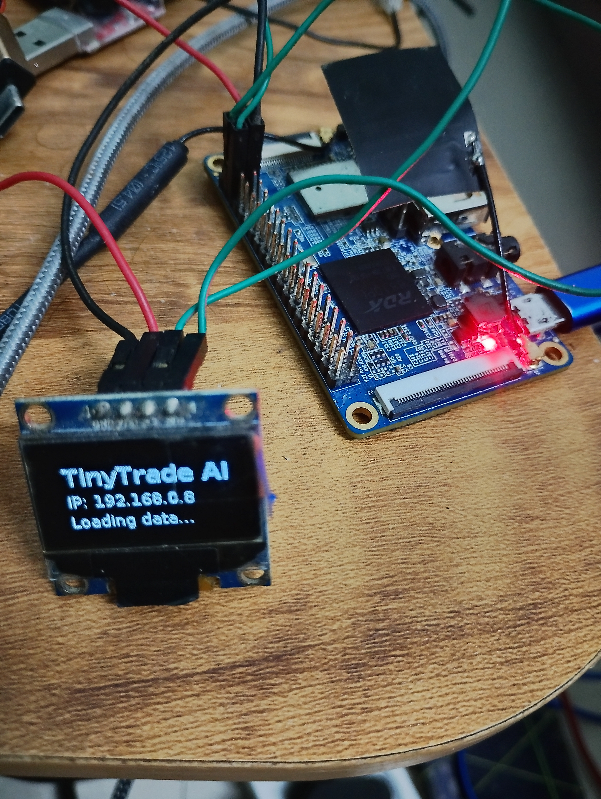
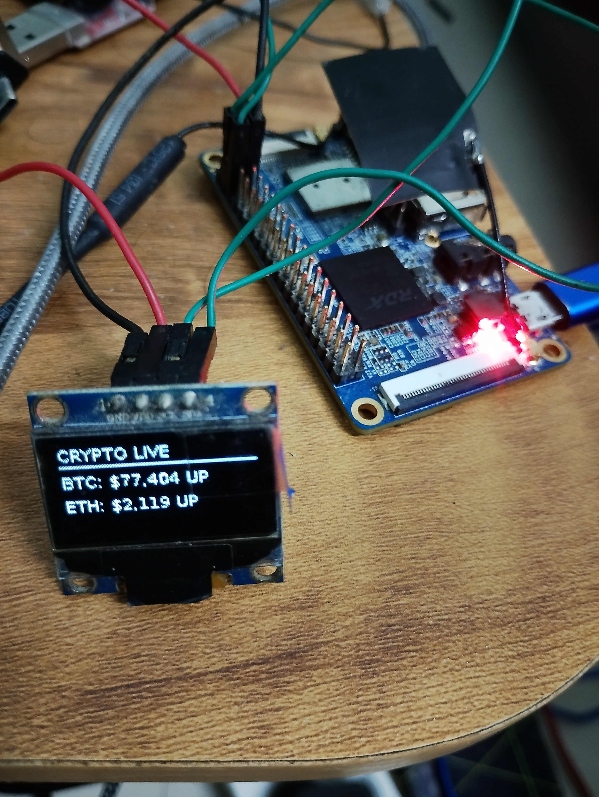
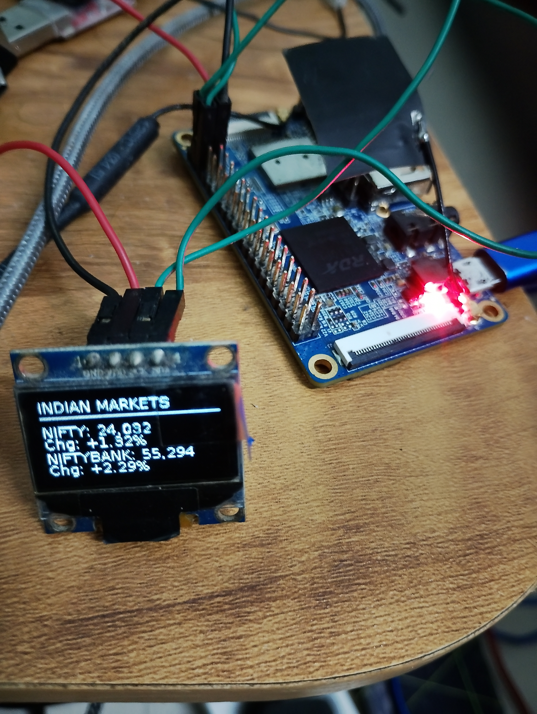

<div align="center">
  <h1>🤖 TinyTrade AI</h1>
  <p><strong>Edge AI Market Intelligence Terminal</strong></p>
  <p>Lightweight · Zero-Dependency · Runs on 256MB RAM</p>

  
  <br/>
  <em>Live OLED ticker showing crypto prices on Orange Pi 2G-IOT</em>

  <br/><br/>

  <a href="#-features">Features</a> •
  <a href="#-hardware-setup">Hardware</a> •
  <a href="#-api-endpoints">API</a> •
  <a href="#-architecture">Architecture</a> •
  <a href="#-deployment">Deployment</a> •
  <a href="#-gpio-pinout">GPIO</a>

  <br/><br/>

  <p>
    
    
    
    
    
  </p>
</div>

---

## 📸 Project Showcase

<div align="center">
  <table>
    <tr>
      <td><br/><em>Live crypto & market ticker</em></td>
      <td><br/><em>AI sentiment & anomaly alerts</em></td>
      <td><br/><em>System status & boot splash</em></td>
    </tr>
  </table>
</div>

---

## ✨ Features

### 📟 Hardware Display
- **SSD1306 OLED (128x64)** — cycles through 55 screens: crypto ticker, NSE indices, marquee stocks, most-active/gainers/losers, NSE AI suggestions, US indices/stocks, US/crypto AI suggestions, sentiment, and alerts
- **16x2 LCD (optional)** — via PCF8574A I2C backpack (auto-discovery)
- **Boot splash** — shows device IP on startup
- **Headless fallback** — runs normally without any display connected

### 📊 Market Data
- **Cryptocurrency** — BTC, ETH, SOL prices from CoinGecko API
- **Indian Stock Market** — NIFTY 50 & NIFTY BANK from NSE India (with market-hours awareness)
- **Configurable polling** — per-asset intervals, adjustable via API at runtime

### 🧠 AI & Analytics
- **Sentiment Analysis** — VADER + TextBlob on financial RSS feeds (CoinTelegraph, CNBC)
- **Anomaly Detection** — pure-Python Z-score on rolling price windows (no numpy!)
- **Signal Generator** — composite BUY/HOLD/SELL signals for crypto, US stocks, and NSE indices + top 10 marquee stocks (e.g., RELIANCE, TCS, HDFCBANK)
- **Indian Market Coverage** — NSE AI suggestions displayed on OLED during market hours (9:00-15:30 IST)

### 🌐 REST API (20+ Endpoints)
- **System** — health check, uptime, memory, display status
- **Market Data** — prices, sentiment history, anomaly alerts
- **Configuration** — live config updates without restart
- **Display Control** — force screen index, test pattern, clear, reset remotely
- **GPIO Control** — export, direction, read/write individual pins
- **Swagger UI** — interactive docs at `/api/docs`

### 🛡️ Zero Trust Telegram Bot
- Strict chat ID validation — only responds to authorized user
- Commands: `/start`, `/status`, `/price`, `/sentiment`, `/alerts`

---

## 🖥️ Hardware Setup

### Bill of Materials
| Component | Model | Notes |
|-----------|-------|-------|
| **SBC** | Orange Pi 2G-IOT | RDA8810 @ 1GHz, 256MB RAM |
| **OLED** | SSD1306 128x64 | I2C address `0x3C` |
| **LCD (opt)** | 16x2 Character | PCF8574A backpack, address `0x38` |
| **SD Card** | 8GB+ | Debian Stretch (kernel 3.10.62) |

### Wiring Diagram
Connect the 4-pin SSD1306 OLED to the Orange Pi GPIO header:

| OLED Pin | Orange Pi 2G-IOT | Header Pin |
|----------|-----------------|------------|
| 🔴 **VCC** | 3.3V | Pin 1 |
| ⚫ **GND** | Ground | Pin 6 |
| 🟡 **SCL** | I2C-0 SCL | Pin 5 |
| 🔵 **SDA** | I2C-0 SDA | Pin 3 |

<div align="center">
  
  <br/>
  <em>Orange Pi 2G-IOT 26-pin GPIO header — I2C-0 on pins 3 (SDA) and 5 (SCL)</em>
</div>

### ⚠️ Known Hardware Issue: rda_sensor Conflict
The kernel driver `rda-sensor` claims I2C address `0x3C` at boot, blocking the OLED. The `scripts/startup.sh` handles this automatically:

```bash
echo 0-003c > /sys/bus/i2c/drivers/rda-sensor/unbind
```

This runs before the application starts, with a 1-second settle delay. A fallback unbind also exists in `/etc/rc.local`.

---

## 🚀 Quick Start

### 1. Enable I2C & Install Dependencies
```bash
sudo apt-get update
sudo apt-get install -y i2c-tools python3-dev python3-pip python3-smbus \
  libfreetype6-dev libjpeg-dev build-essential
```

### 2. Verify I2C Bus
```bash
i2cdetect -y 0
```
You should see `3c` in the output (OLED) and optionally `38` (LCD).

### 3. Clone & Install
```bash
git clone https://github.com/luckyhegde6/TinyTradeAi.git
cd TinyTradeAi

python3 -m venv venv
source venv/bin/activate

# Symlink system smbus into venv (Debian Stretch workaround)
ln -sf /usr/lib/python3/dist-packages/smbus.cpython-35m-arm-linux-gnueabihf.so \
  venv/lib/python3.5/site-packages/

pip install -r requirements.txt
```

### 4. Configure Environment
```bash
cp .env.example .env
# Edit .env with your Telegram bot token and chat ID
```

### 5. Run
```bash
python main.py
```

### 6. Enable Auto-Start on Boot
```bash
sudo cp scripts/tinytrade.service /etc/systemd/system/
sudo systemctl daemon-reload
sudo systemctl enable tinytrade.service
sudo systemctl start tinytrade.service
```

---

## 📡 API Endpoints

All endpoints are served at `http://<device-ip>:5000`. Interactive Swagger UI: [`/api/docs`](http://192.168.0.8:5000/api/docs)

### System & Status
| Method | Endpoint | Description |
|--------|----------|-------------|
| `GET` | `/api/status` | 🩺 Health check — uptime, memory, OLED/LCD state |
| `POST` | `/api/system/restart` | 🔄 Graceful app restart (systemd respawns) |

### Market Data
| Method | Endpoint | Description |
|--------|----------|-------------|
| `GET` | `/api/prices` | 💰 All tracked asset prices |
| `GET` | `/api/prices/{symbol}` | 🔍 Single asset price (e.g., `BTC`, `NIFTY`) |
| `GET` | `/api/sentiment` | 📰 Recent AI sentiment results |
| `GET` | `/api/alerts` | ⚠️ Recent anomaly alerts |

### Configuration
| Method | Endpoint | Description |
|--------|----------|-------------|
| `GET` | `/api/config` | ⚙️ Read all runtime config |
| `PUT` | `/api/config` | ✏️ Update config live (no restart needed) |

### Display Control
| Method | Endpoint | Description |
|--------|----------|-------------|
| `POST` | `/api/display/screen/oled` | 🎯 Force OLED to screen index |
| `POST` | `/api/display/screen/lcd` | 🎯 Force LCD to screen index |
| `POST` | `/api/display/oled/test` | 🖼️ Show OLED test pattern |
| `POST` | `/api/display/oled/clear` | 🧹 Clear OLED |
| `POST` | `/api/display/oled/reset` | 🔄 Re-initialize OLED |
| `POST` | `/api/display/lcd/test` | 🖼️ Show LCD test pattern |
| `POST` | `/api/display/lcd/clear` | 🧹 Clear LCD |
| `POST` | `/api/display/lcd/reset` | 🔄 Re-initialize LCD |

### GPIO Control
| Method | Endpoint | Description |
|--------|----------|-------------|
| `GET` | `/api/gpio` | 📋 List all 16 GPIOs with state |
| `GET` | `/api/gpio/{pin}` | 🔍 Get single GPIO state |
| `POST` | `/api/gpio/export` | 📤 Export GPIO `{"pin": N}` |
| `POST` | `/api/gpio/unexport` | 📥 Unexport GPIO `{"pin": N}` |
| `POST` | `/api/gpio/{pin}/direction` | 🧭 Set direction `{"direction": "in"|"out"}` |
| `POST` | `/api/gpio/{pin}/value` | 🔌 Set value `{"value": 0|1}` |

### Quick Examples
```bash
# Get system status
curl http://192.168.0.8:5000/api/status

# Force OLED to screen 2 (sentiment)
curl -X POST http://192.168.0.8:5000/api/display/screen/oled \
  -H "Content-Type: application/json" -d '{"screen": 2}'

# Show OLED test pattern
curl -X POST http://192.168.0.8:5000/api/display/oled/test

# Update crypto polling to 30s
curl -X PUT http://192.168.0.8:5000/api/config \
  -H "Content-Type: application/json" -d '{"crypto_poll_interval": 30}'

# Set GPIO 7 high
curl -X POST http://192.168.0.8:5000/api/gpio/7/value \
  -H "Content-Type: application/json" -d '{"value": 1}'
```

---

## 🏗️ Architecture

```
tinyTradeAi/
├── ai/                  # 🧠 AI & Analytics
│   ├── sentiment.py     #     VADER + TextBlob on RSS feeds
│   ├── anomaly.py       #     Z-score anomaly detection (no numpy)
│   └── signals.py       #     Composite signal generation
│
├── api/                 # 🌐 REST API Server
│   ├── app.py           #     Flask app with 20+ endpoints
│   └── telegram.py      #     Zero Trust Telegram bot
│
├── database/            # 💾 SQLite Layer
│   └── db.py            #     Thread-safe SQLite3 operations
│
├── display/             # 🖥️ Display Manager
│   └── manager.py       #     Unified init, health check, screen routing
│
├── oled/                # 🟢 SSD1306 OLED
│   ├── display.py       #     luma.oled → simple_driver fallback
│   ├── simple_driver.py #     Pure-Python I2C driver (no deps)
│   ├── screens.py       #     Screen drawing functions
│   └── animations.py    #     Screen rotation loop
│
├── lcd/                 # 🔲 16x2 LCD (optional)
│   ├── driver.py        #     PCF8574 4-bit I2C protocol
│   ├── display.py       #     Auto-discovery + singleton init
│   └── screens.py       #     LCD screen content
│
├── fetchers/            # 📡 Data Fetchers
│   ├── crypto.py        #     CoinGecko API
│   ├── stocks.py        #     NSE India (with market-hours cache)
│   └── news.py          #     RSS feed parser
│
├── utils/               # 🛠️ Utilities
│   ├── helpers.py       #     Logger, IP detection, price formatting
│   ├── config_manager.py#     Thread-safe JSON runtime config
│   └── gpio.py          #     Sysfs GPIO control
│
├── scripts/             # 📜 Deployment & System
│   ├── startup.sh       #     Pre-flight checks + app launcher
│   ├── tinytrade.service#     systemd unit file
│   ├── _deploy.py       #     Full deployment script
│   ├── _deploy_updates.py#    Incremental file sync
│   └── run_remote_tests.sh#  Remote test runner
│
├── tests/               # 🧪 Test Suite
│   ├── test_api_endpoints.py  # 30 API tests
│   ├── test_oled_*.py         # OLED hardware & integration
│   └── test_lcd_*.py          # LCD hardware & integration
│
├── config.py            # ⚙️ Static configuration
├── runtime_config.json  # 🔄 Runtime-persistent config
├── main.py              # 🚀 Entry point
└── requirements.txt     # 📦 Dependencies (7 packages only)
```

### How It All Fits Together

```
┌──────────────┐     ┌──────────────┐     ┌──────────────┐
│  CoinGecko   │     │  NSE India   │     │  RSS Feeds   │
│  (Crypto)    │     │  (Stocks)    │     │  (News)      │
└──────┬───────┘     └──────┬───────┘     └──────┬───────┘
       │                    │                    │
       ▼                    ▼                    ▼
┌──────────────────────────────────────────────────────┐
│                  Data Fetchers                        │
│            (requests, no pandas!)                     │
└────────┬─────────────┬──────────────┬────────────────┘
         │             │              │
         ▼             ▼              ▼
┌────────────┐ ┌────────────┐ ┌──────────────┐
│  SQLite DB │ │AI Sentiment│ │   Anomaly    │
│  (prices,  │ │  (VADER +  │ │   Detector   │
│   alerts)  │ │  TextBlob) │ │  (Z-score)   │
└────────────┘ └────────────┘ └──────────────┘
         │             │              │
         ▼             ▼              ▼
┌─────────────────────────────────────────┐
│           Display Manager               │
│   ┌──────────┐    ┌──────────┐          │
│   │   OLED   │    │   LCD    │          │
│   │ SSD1306  │    │ PCF8574  │          │
│   └──────────┘    └──────────┘          │
└────────────────┬────────────────────────┘
                 │
                 ▼
┌─────────────────────────────────────────┐
│           Flask API Server              │
│   ┌──────────────────────────┐          │
│   │  /api/status  /api/config│          │
│   │  /api/prices  /api/gpio  │          │
│   │  /api/display/*          │          │
│   │  /api/system/restart     │          │
│   │  /api/docs (Swagger UI)  │          │
│   └──────────────────────────┘          │
└─────────────────────────────────────────┘
```

---

## 🧪 Testing

```bash
# Run all API endpoint tests (30 tests)
cd /opt/tinyTradeAi
source venv/bin/activate
python tests/test_api_endpoints.py

# Run remotely from dev machine
python scripts/run_api_tests.py

# Run hardware tests
python tests/test_oled_integration.py
python tests/test_lcd_hardware.py
```

---

## 📦 Memory Budget (256MB)

| Component | RAM Usage |
|-----------|-----------|
| Operating System (Debian) | ~80 MB |
| Python main.py (Flask + OLED + AI) | ~36 MB |
| Network services (sshd, dnsmasq) | ~15 MB |
| **Total** | **~130 MB (50% free)** |

Key to low footprint:
- ✅ **No pandas** — replaced with pure Python `math.sqrt()` for Z-score
- ✅ **No numpy** — not a single import
- ✅ **No transformers** — VADER + TextBlob are tiny
- ✅ **No yfinance** — direct `requests` to NSE API
- ✅ **No feedparser** — `xml.etree` built-in
- ✅ **No FastAPI/uvicorn** — Flask + threaded WSGI (Python 3.5 compat)

---

## 🔧 Advanced Configuration

### Runtime Config (editable via API)
| Key | Default | Description |
|-----|---------|-------------|
| `crypto_poll_interval` | `60` | Crypto price fetch interval (seconds) |
| `stocks_poll_interval` | `900` | Stock price fetch interval (seconds) |
| `news_poll_interval` | `900` | RSS fetch interval (seconds) |
| `screen_rotation_interval` | `5` | Display screen rotation interval (seconds) |
| `oled_enabled` | `true` | Enable OLED output |
| `lcd_enabled` | `false` | Enable LCD output |

### Startup Script (`scripts/startup.sh`)
On every boot, the startup script:
1. ⏳ Waits for `/dev/i2c-0` (up to 10s)
2. 🔓 Unbinds `rda-sensor` from `0x3C` (frees OLED address)
3. ⏱️ Sleeps 1s for I2C bus settle
4. 🔍 Probes OLED at `0x3C` (3 attempts with backoff)
5. 🚀 Launches `main.py` via `exec`

### Display Health Check
A watchdog runs every 60 seconds in the main loop:
- **OLED missing?** — Re-probes with singleton reset (cooldown: 60s)
- **LCD missing?** — Logs once, re-checks every 5 minutes

---

## 📜 License

MIT License — see [LICENSE](LICENSE) for details.

---

<div align="center">
  <sub>Built with ❤️ for ultra-low-power edge AI — Orange Pi 2G-IOT (256MB RAM)</sub>
  <br/>
  <sub>📖 <a href="https://github.com/luckyhegde6/TinyTradeAi">GitHub</a></sub>
</div>
