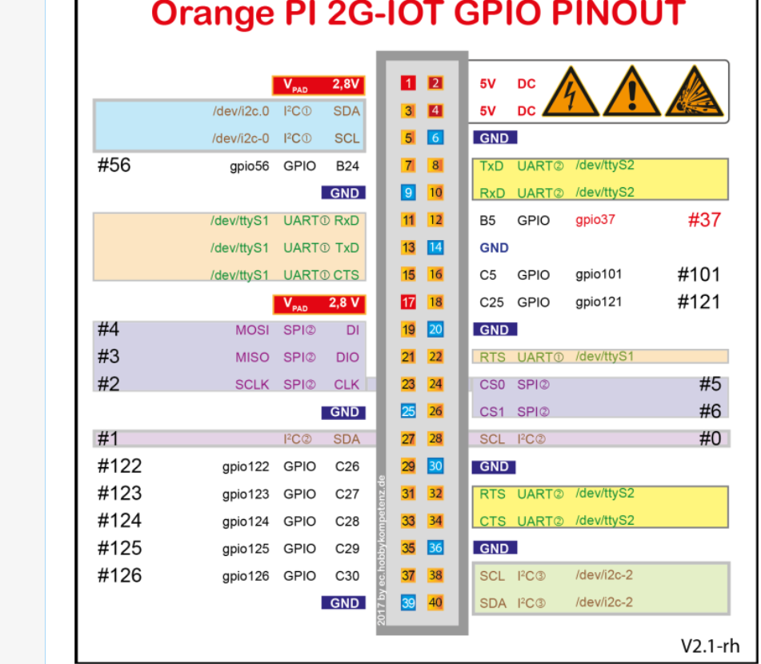

# Orange Pi 2G-IOT Setup Guide

This guide walks you through setting up the OS and firmware from scratch.

## 1. Required Hardware
- Orange Pi 2G-IOT Board
- MicroSD Card (8GB or 16GB Class 10 recommended)
- MicroUSB cable for power
- USB to TTL Serial Cable (Highly Recommended for debugging)

## 2. Board Reference
Below are the top and bottom views of the Orange Pi 2G-IOT.

### Top View


### Bottom View


### Pinout Diagram


#### 40-Pin Header GPIO Mapping (V2.1-rh Pinout Reference)
| Pin | Name / Signal | Primary function | Description / Voltage Level |
| :---: | :--- | :--- | :--- |
| **1** | `V_PAD 2.8V` | Power Out | 2.8V DC Power (Recommended for OLED VCC to match logic level) |
| **2** | `5V DC` | Power Out | 5V DC Power |
| **3** | `I2C0 SDA` | I2C Data | `/dev/i2c-0` Data Line (2.8V Logic Level) |
| **4** | `5V DC` | Power Out | 5V DC Power |
| **5** | `I2C0 SCL` | I2C Clock | `/dev/i2c-0` Clock Line (2.8V Logic Level) |
| **6** | `GND` | Ground | System Ground |
| **27** | `I2C2 SDA` | I2C Data (alt) | `/dev/i2c-2` / `/dev/i2c-1` Data Line (2.8V Logic Level) |
| **28** | `I2C2 SCL` | I2C Clock (alt) | `/dev/i2c-2` / `/dev/i2c-1` Clock Line (2.8V Logic Level) |
| **38** | `I2C2 SCL` | I2C Clock | `/dev/i2c-2` Clock Line (2.8V Logic Level) |
| **40** | `I2C2 SDA` | I2C Data | `/dev/i2c-2` Data Line (2.8V Logic Level) |
| **GND** | `GND` | Ground | Additional Ground Pins: **9, 14, 20, 25, 30, 36, 39** |

## 3. Download the OS
The 2G-IOT uses a specific RDA8810 ARM Cortex-A5 processor. Standard Raspberry Pi images will not work.
1. Go to the [Orange Pi Official Site](http://www.orangepi.org/html/hardWare/computerAndMicrocontrollers/details/Orange-Pi-2G-IoT.html).
2. Download the official **Ubuntu/Debian** Server image.
3. Extract the `.img` file.

## 4. Flash the SD Card
1. Insert your MicroSD card into your PC.
2. Format the SD card using **SD Card Formatter**.
3. Download and open **Win32DiskImager** (or BalenaEtcher).
4. Select the extracted `.img` file, choose your SD card drive, and click **Write**.

## 5. Hardware Boot Preparation (IMPORTANT)
1. **Change the Jumper Pin**: If you are planning to boot from the SD card, you MUST change the position of the boot selection jumper pin on the board. Otherwise, it will not boot from the SD card.
2. Insert the flashed MicroSD card into the Orange Pi.

## 6. Serial Console Setup
Since the board has no initial WiFi configuration, you will need a USB-to-TTL Serial Converter.
1. Identify the 3 serial pins on the Orange Pi (TX, RX, Ground).
2. Connect the jumper wires:
   - **Ground** of converter to **Ground** of Orange Pi.
   - **TX** of converter to **RX** of Orange Pi.
   - **RX** of converter to **TX** of Orange Pi.
3. Plug the converter into your laptop and open **PuTTY**.
4. Select **Serial** connection type.
5. Enter the correct COM port and set the baud rate to **115200**.

## 7. First Boot & WiFi Setup
1. Connect the power cable to the Orange Pi. The red LED will glow and it will start booting.
2. Once booted in PuTTY, login with username: `root` and password: `orangepi` (without spaces).
3. Set up Wi-Fi using the standard `orangepi-config` utility:
   * **Run the configuration utility:**
     ```bash
     sudo orangepi-config
     ```
     *(Note: If `orangepi-config` is not installed on your image, you can run `sudo armbian-config` which is the upstream equivalent).*
   * **Navigate the menu:**
     * Use the arrow keys to select **Network** and press Enter.
     * Select **WiFi** and press Enter.
     * The system will scan for wireless networks. Select your Wi-Fi network's SSID from the list and press Enter.
     * Type in your Wi-Fi password when prompted, select **OK**, and press Enter.
     * The utility will establish a connection, request an IP address, and save the network profile. 
     * Once connected, select **Back** and **Exit** to return to the terminal command prompt.
4. Verify your IP address and test your internet connection by running:
   ```bash
   ifconfig wlan0
   ping -c 3 google.com
   ```
6. **Enable and Verify SSH**: On these Debian server images, SSH is usually enabled by default. If it is not running, enable it using:
   ```bash
   sudo systemctl enable ssh
   sudo systemctl start ssh
   ```
   Now you can disconnect the serial cable if desired and connect directly from your host PC via SSH using the IP address from step 5:
   ```bash
   ssh root@<orange-pi-ip>
   ```

7. **Fix EOL Repositories & Install Packages**: Since Debian 9 (Stretch) is End-of-Life (EOL), standard mirrors will return `404 Not Found` when trying to run `apt-get`. You must redirect your repository list to the Debian Archives to enable package installation (including `i2c-tools` and python packages):
   
   * **Back up your current sources list:**
     ```bash
     sudo cp /etc/apt/sources.list /etc/apt/sources.list.bak
     ```
   
   * **Redirect package sources to the Debian Archives:**
     We will write the archive URL to `/etc/apt/sources.list` and append the `[trusted=yes]` flag. This flag is crucial because the legacy GPG signing keys for Debian Stretch have expired:
     ```bash
     sudo tee /etc/apt/sources.list <<EOF
     deb [trusted=yes] http://archive.debian.org/debian stretch main contrib non-free
     deb [trusted=yes] http://archive.debian.org/debian-security stretch/updates main contrib non-free
     EOF
     ```
   
   * **Update the package list:**
     ```bash
     sudo apt-get update
     ```
   
   * **Install `i2c-tools` and optional helper dependencies:**
     ```bash
     sudo apt-get install -y i2c-tools read-edid
     ```

## 8. Enable I2C & Verify Connection

> **Note**: This board runs the official **OrangePi Debian** image, not Armbian. The command `armbian-config` does **not** exist. Use `orangepi-config` instead.

**Good news**: On this image, all three I2C buses (`/dev/i2c-0`, `/dev/i2c-1`, `/dev/i2c-2`) are already active by default — no configuration utility is needed. You can confirm this with:
```bash
ls -l /dev/i2c-*
# Expected output:
# crw-rw---- 1 root i2c 89, 0 ... /dev/i2c-0
# crw-rw---- 1 root i2c 89, 1 ... /dev/i2c-1
# crw-rw---- 1 root i2c 89, 2 ... /dev/i2c-2
```

If for any reason you need to enable or configure hardware settings on this board, use the native config utility:
```bash
sudo orangepi-config
```
Navigate to **System -> Hardware** and toggle `i2c-0` on, then reboot.

### Connect the OLED Display
Connect the display using the following **exact** pin mapping from the V2.1-rh GPIO pinout:

| OLED Pin | Orange Pi Header Pin | Signal |
| :--- | :--- | :--- |
| **VCC** | **Pin 2 or Pin 4** (`5V DC`) | Power (use 5V for most commercial OLED breakout boards) |
| **GND** | **Pin 6** (Ground) | Ground |
| **SDA** | **Pin 3** (`I2C0 SDA`, `/dev/i2c-0`) | I2C Data |
| **SCL** | **Pin 5** (`I2C0 SCL`, `/dev/i2c-0`) | I2C Clock |

> **Important**: Pin 1 on this board outputs only `2.8V` (not 3.3V). Most commercial SSD1306 OLED breakouts have onboard regulators designed for 3.3V-5V input. Use **Pin 2 or Pin 4 (5V)** for reliable power.

### Verify the I2C Connection
Check all three I2C buses to find where the display responds:
```bash
sudo i2cdetect -y 0   # Bus 0 (Pin 3 = SDA, Pin 5 = SCL)
sudo i2cdetect -y 1   # Bus 1 (Pin 27 = SDA, Pin 28 = SCL)
sudo i2cdetect -y 2   # Bus 2 (Pin 40 = SDA, Pin 38 = SCL)
```

**Interpreting the output:**
* **`3c`** appears on a bus → OLED is active and ready for Python!
* **`UU`** appears at `3c` on bus 0 → The built-in `rda-sensor` kernel driver has claimed the address. Release it:
  ```bash
  echo 0-003c | sudo tee /sys/bus/i2c/drivers/rda-sensor/unbind
  sudo i2cdetect -y 0   # Should now show 3c
  ```
* **`--`** everywhere → Display is not responding. Check: correct pins, firm connections, or try swapping SDA/SCL wires.

## 9. Install Python Environment
```bash
sudo apt-get install python3 python3-venv python3-pip libfreetype6-dev libjpeg-dev build-essential
```
Proceed to the TinyTrade AI setup instructions in the main README.

## 10. Troubleshooting Boot Freezes & Wi-Fi Hangs

If your Orange Pi 2G-IOT gets stuck during or immediately after the boot sequence (especially after configuring Wi-Fi via `orangepi-config`), consult the following verified resolutions.


### Case A: Terminal Freezes or Shows Garbage (`▒`) After Uncompressing Linux
* **Symptom:** You see the U-Boot logs perfectly, but right after `Uncompressing Linux... done, booting the kernel.`, the screen either stops printing completely or displays garbage characters (like `▒`).
* **Root Cause:** **Baud Rate Mismatch.** The bootloader (U-Boot) on this image runs at `115200` baud, but the kernel command line switches the serial port (`ttyS0`) to **`921600`** baud once it starts booting (`console=ttyS0,921600`).
* **Solution:** 
  1. Change your PuTTY or serial terminal configuration baud rate to **`921600`**.
  2. Restart the board. You will now see the entire boot sequence and the login prompt.

### Case B: System Hangs During Network Initialization (Wait-Online Service)
* **Symptom:** The kernel boots, but hangs for 2 to 3 minutes before presenting the login prompt.
* **Root Cause:** When Wi-Fi is configured via `orangepi-config`, the network manager creates a profile. During boot, `systemd-networkd-wait-online.service` or `NetworkManager-wait-online.service` blocks the startup sequence while waiting to establish a Wi-Fi connection and assign an IP address. On a low-memory 256MB RAM board, this lag makes the system appear dead.
* **Solution:**
  1. Boot the board and wait at least **3 full minutes** to see if the login prompt eventually appears.
  2. Once logged in, disable the blocking wait-online service:
     ```bash
     sudo systemctl disable systemd-networkd-wait-online.service
     sudo systemctl disable NetworkManager-wait-online.service
     ```

### Case C: Hard Freeze / Crash Caused by the RDA5991 Wi-Fi Driver
* **Symptom:** The board locks up completely or triggers a kernel panic when trying to connect to Wi-Fi.
* **Root Cause:** The onboard RDA5991 Wi-Fi/BT module requires highly stable power. When the Wi-Fi radio begins searching or connecting, it draws sudden power spikes. If you are powering the board from a generic laptop USB port or a cheap charger, the voltage will drop below 4.8V, triggering a brownout lockup or a driver crash.
* **Solution:**
  1. **Ensure a Stable Power Supply:** Use a dedicated 5V / 2.0A or 2.5A USB wall charger. Do NOT power the board from a laptop USB port.
  2. **Avoid NetworkManager:** Set up Wi-Fi using the lightweight `wpa_cli` (shown in Section 7) instead of the resource-heavy `orangepi-config`.

### Case D: Instability Caused by ALSA Audio Utilities
* **Symptom:** Configuring Wi-Fi triggers a system crash or kernel panics related to sound/audio drivers on boot.
* **Root Cause:** The custom 3.10.62 kernel for the RDA8810 has a known conflict between the audio subsystem and the network stack initialization.
* **Solution:** Purge the conflicting audio utility packages (audio is not required for the TinyTrade terminal):
  ```bash
  sudo apt-get purge --auto-remove alsa-utils
  sudo reboot
  ```

### Case E: OLED I2C Address Shows 'UU' in `i2cdetect`
* **Symptom:** Running `sudo i2cdetect -y 0` shows `UU` at address `0x3c` instead of `3c` or `--`.
* **Root Cause:** The hardware connection is perfectly correct, but the Linux kernel has loaded a built-in framebuffer driver (like `ssd1306fb` or `ssd130x`) that has claimed the display's I2C address. When the kernel driver owns the device, userspace Python libraries (like `luma.oled`) will fail to open it and return a "Device or resource busy" error.
* **Solution:** Unload the kernel driver and blacklist it to restore userspace control:
  1. **Identify the loaded driver module:**
     ```bash
     lsmod | grep -E "ssd130|fb"
     ```
  2. **Temporarily unload the conflicting module:**
     ```bash
     sudo rmmod ssd130x_i2c 2>/dev/null || sudo rmmod ssd1306fb 2>/dev/null
     ```
  3. **Verify the change:**
     Run `sudo i2cdetect -y 0`. The address `3c` should now show as `3c` instead of `UU`.
  4. **Permanently blacklist the module** to prevent it from auto-loading on reboot:
     ```bash
     echo "blacklist ssd130x_i2c" | sudo tee /etc/modprobe.d/ssd1306-blacklist.conf
     echo "blacklist ssd1306fb" | sudo tee -a /etc/modprobe.d/ssd1306-blacklist.conf
     ```

