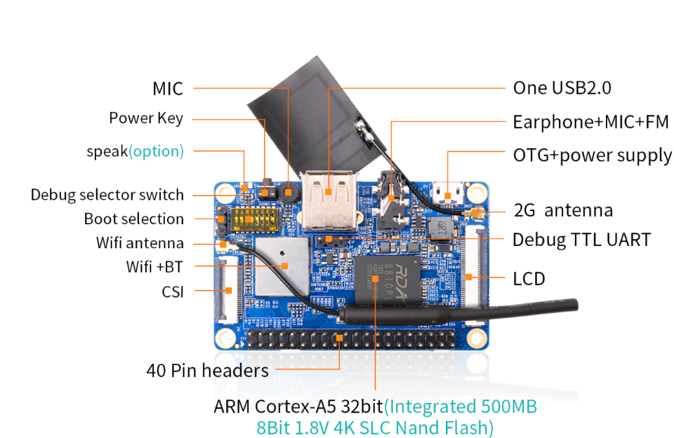
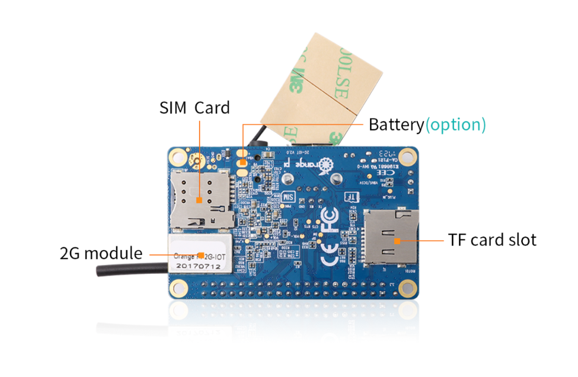
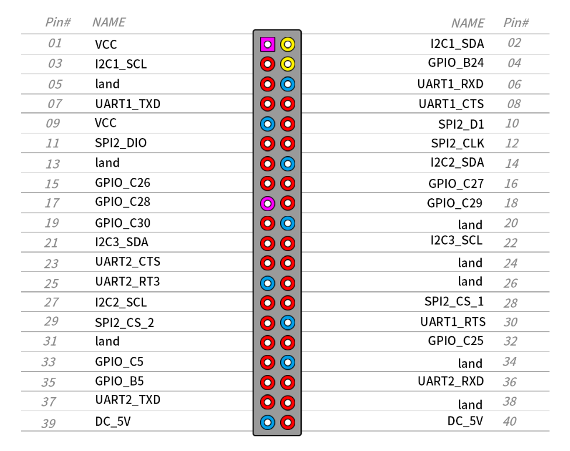

# Orange Pi 2G-IOT Setup Guide

This guide walks you through setting up the OS and firmware from scratch.

## 1. Required Hardware
- Orange Pi 2G-IOT Board
- MicroSD Card (8GB or 16GB Class 10 recommended)
- MicroUSB cable for power
- USB to TTL Serial Cable (Highly Recommended for debugging)

## 2. Board Reference
Below are the top and bottom views of the Orange Pi 2G-IOT.

### Top View


### Bottom View


### Pinout Diagram


## 3. Download the OS
The 2G-IOT uses a specific RDA8810 ARM Cortex-A5 processor. Standard Raspberry Pi images will not work.
1. Go to the [Orange Pi Official Site](http://www.orangepi.org/html/hardWare/computerAndMicrocontrollers/details/Orange-Pi-2G-IoT.html).
2. Download the official **Ubuntu/Debian** Server image.
3. Extract the `.img` file.

## 4. Flash the SD Card
1. Insert your MicroSD card into your PC.
2. Format the SD card using **SD Card Formatter**.
3. Download and open **Win32DiskImager** (or BalenaEtcher).
4. Select the extracted `.img` file, choose your SD card drive, and click **Write**.

## 5. Hardware Boot Preparation (IMPORTANT)
1. **Change the Jumper Pin**: If you are planning to boot from the SD card, you MUST change the position of the boot selection jumper pin on the board. Otherwise, it will not boot from the SD card.
2. Insert the flashed MicroSD card into the Orange Pi.

## 6. Serial Console Setup
Since the board has no initial WiFi configuration, you will need a USB-to-TTL Serial Converter.
1. Identify the 3 serial pins on the Orange Pi (TX, RX, Ground).
2. Connect the jumper wires:
   - **Ground** of converter to **Ground** of Orange Pi.
   - **TX** of converter to **RX** of Orange Pi.
   - **RX** of converter to **TX** of Orange Pi.
3. Plug the converter into your laptop and open **PuTTY**.
4. Select **Serial** connection type.
5. Enter the correct COM port and set the baud rate to **115200**.

## 7. First Boot & WiFi Setup
1. Connect the power cable to the Orange Pi. The red LED will glow and it will start booting.
2. Once booted in PuTTY, login with username: `root` and password: `orangepi` (without spaces).
3. Set up WiFi using `wpa_cli`:
   ```bash
   wpa_cli
   > add_network
   # It will output a network ID (e.g., 2)
   > set_network 2 ssid "your_network_name"
   > set_network 2 psk "your_password"
   > select_network 2
   > quit
   ```
4. Request an IP address by running `dhclient` (or `dhclient wlan0`).
5. Verify your IP address by running `ifconfig` and pinging an external site to check connectivity.

## 8. Enable I2C (For the OLED)
1. Run `sudo armbian-config` or edit `/boot/armbianEnv.txt` (depending on OS).
2. Go to System -> Hardware and enable `i2c-0` and `i2c-1`.
3. Reboot: `sudo reboot`
4. Install I2C tools: `sudo apt-get update && sudo apt-get install i2c-tools`
5. Connect your OLED (VCC to 3.3V, GND to GND, SCL to Pin 5, SDA to Pin 3).
6. Verify connection: `sudo i2cdetect -y 0` (You should see `3c`).

## 9. Install Python Environment
```bash
sudo apt-get install python3 python3-venv python3-pip libfreetype6-dev libjpeg-dev build-essential
```
Proceed to the TinyTrade AI setup instructions in the main README.
